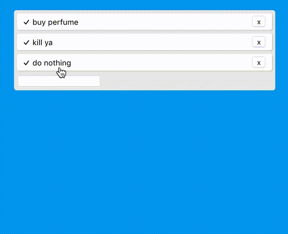

`as of commit #6f0b64b322b6992ef5b3a2858572f43e3892fc01`

# Description
Built using react hooks and react-spring. A good example of how to implement animations using react-spring, a great react physics based animation library!

# Run
Do a `yarn` and then a `yarn start` to run the app on your local machine.
